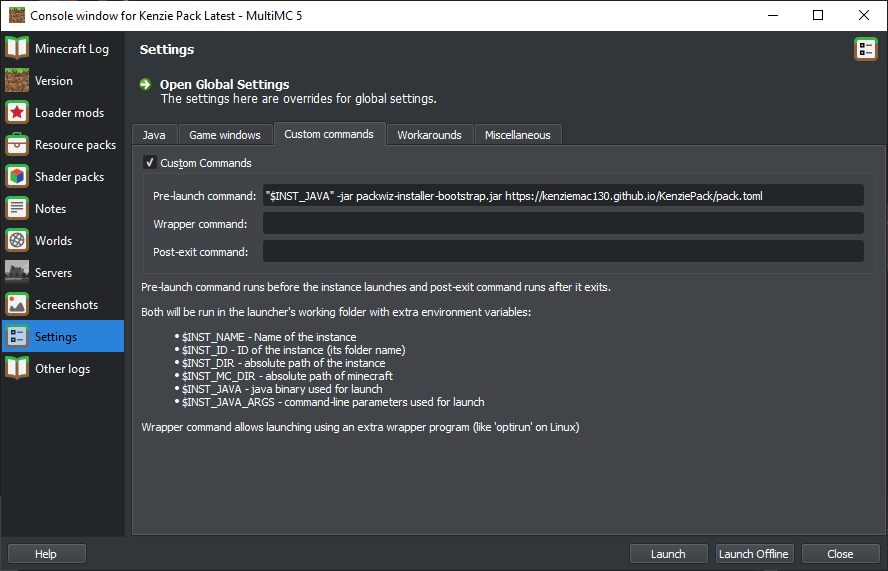

# First Time Installation MultiMC/Prism Launcher

I recommend using the MultiMC or Prism launcher to manage your minecraft installation. 

1. Install the Launcher if you haven't already

    1a. Install launcher (follow their install steps)
    * [MultiMC](https://multimc.org/)
    * [Prism](https://prismlauncher.org/) (recommended to use flatpack package on steamdeck)

    1b. Setup Java 17

    * on first launch you will be prompted to locate your java executable
    * you may need to install OpenJDK 17 and point to your "javaw" file manually [Java Version Archive](https://jdk.java.net/archive/)
    * extract the zip somewhere safe and point to `jdk-17/bin/javaw.exe` (or whatever format your OS uses)

    1c. Login to your account
    * for new accounts you will have to launch at least once with the official launcher for first time setup
    * under the profiles dropdown on the top right of the screen choose "Manage Accounts" then "Add Microsoft"
    * if you have not yet migrated your old mojang to microsoft account [please do](https://www.minecraft.net/en-us/login?view=mojang)
    * complete the steps on the page as instructed

2. Add new instance of Minecraft 1.19.2 (will not work on other versions)
    
    

3. Right-click the instance you just made and choose "Edit Instance"

    

4. Select the "Install Fabric" option

    

5. Choose version 0.14.13 and click ok

    

6. Go to Settings, custom commands, check the custom commands box, and paste the following into pre-launch

    `"$INST_JAVA" -jar packwiz-installer-bootstrap.jar https://kenziemac130.github.io/KenziePack/pack.toml`

    

7. Close out the options window and right click again on the icon, this time selecting "Minecraft Folder"

    

8. Download the [following file](https://github.com/packwiz/packwiz-installer-bootstrap/releases/download/v0.0.3/packwiz-installer-bootstrap.jar) and place into the root of the opened minecraft folder

    

9. Launch the game and the mods will be automatically installed and updated every time you launch

## Further Reading

[Packwiz Installation Tutorial](https://packwiz.infra.link/tutorials/installing/packwiz-installer/)