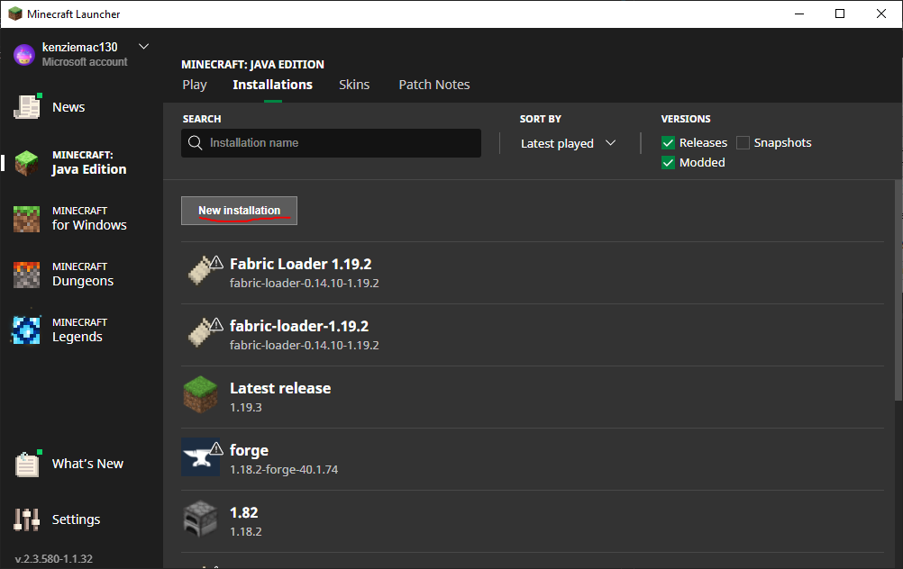
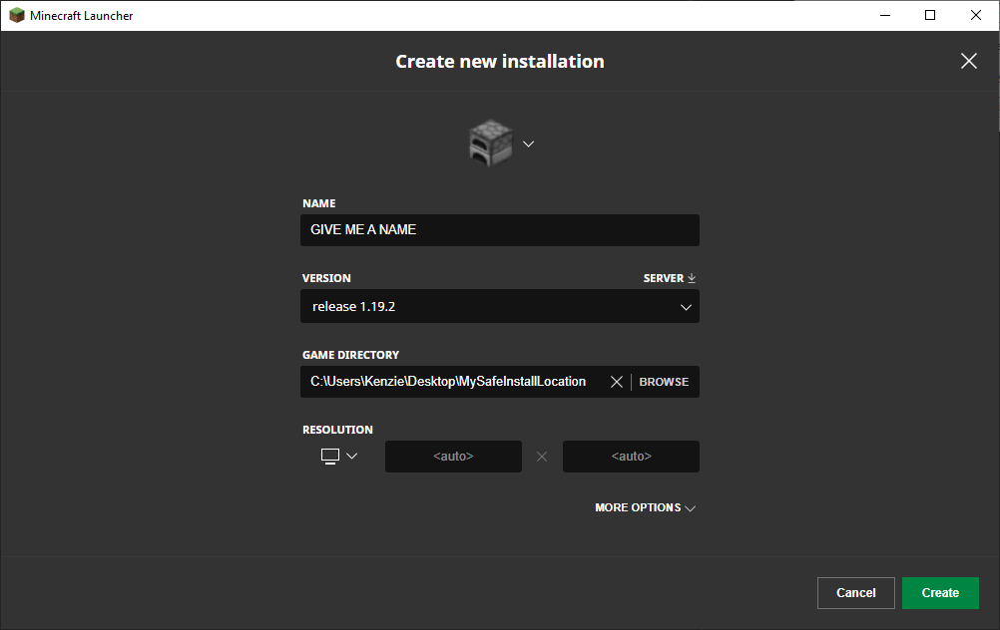
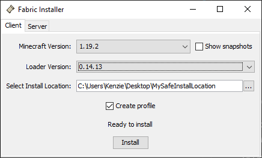
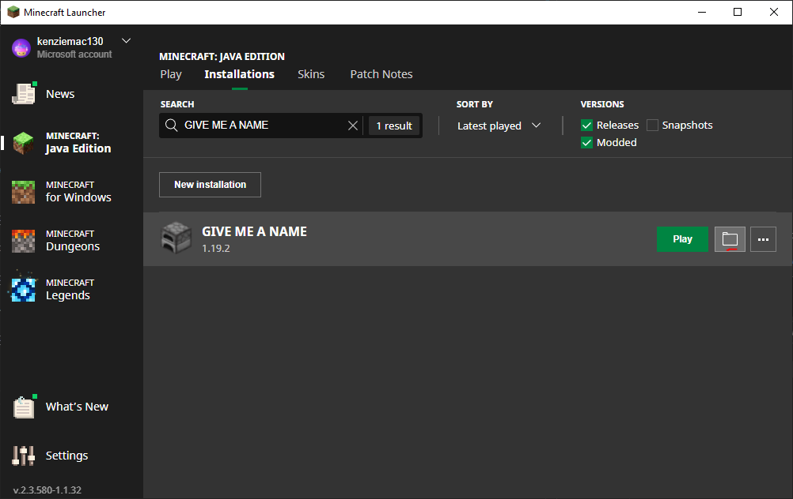
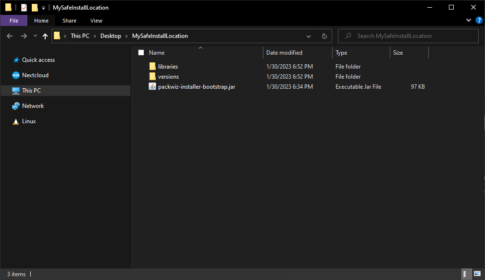

# Painful Installation using Official Launcher (NOT SUPPORTED)

By doing this
* you will have a more painful setup
* you will not have a clean way to organize installations
* you will have to run the dreaded step 6 every time there is a modpack update
* you will not know when updates happen unless you check discord
* you are going to have a bad time

If for some reason you *really* want to use the original minecraft launcher here are the following steps

1. In the Minecraft Launcher under Java Edition select "Installations" and choose "New Installation"

    

2. Create an installation that points to your saved folder with Minecraft 1.19.2 release

    ⚠️ **WARNING** ⚠️ **CHANGE THE GAME DIRECTORY TO SOMWHERE ELSE**

    

3. Download the fabric installer and run it with these settings

    https://fabricmc.net/use/installer/

    * Minecraft Version: 1.19.2
    * Loader Version: 0.14.13
    * Install location: YOUR_PATH_NAME_HERE
    * Create profile: false

    

4. Open the minecraft folder

    

5. Download the following file and place into the root of the opened minecraft folder

    https://github.com/packwiz/packwiz-installer-bootstrap/releases/download/v0.0.3/packwiz-installer-bootstrap.jar

    
    
6. Okay... here is where things are really going to suck...
    
    This step is Windows only so it will have to be tweaked a bit for other systems

    If this step looks like it sucks please jump to MultiMC ASAP

    6a. Open the folder in command prompt (terminal on mac/linux) and "cd" (current directory) into the opened folder

    `cd FOLDER_PATH_HERE`

    6b. Run the following command(s)

    Windows:
    `"C:\Program Files (x86)\Minecraft Launcher\runtime\java-runtime-beta\windows-x64\java-runtime-beta\bin\javaw.exe" -jar packwiz-installer-bootstrap.jar https://kenziemac130.github.io/KenziePack/pack.toml` (enter)

    Mac: `brew cask install java` (enter) followed by `java -jar packwiz-installer-bootstrap.jar https://kenziemac130.github.io/KenziePack/pack.toml` (enter)

    Linux: `sudo apt install java` (enter) followed by `java -jar packwiz-installer-bootstrap.jar https://kenziemac130.github.io/KenziePack/pack.toml` (enter)

7. If after all of this its broken then **PLEASE USE MULTIMC**